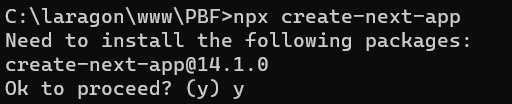
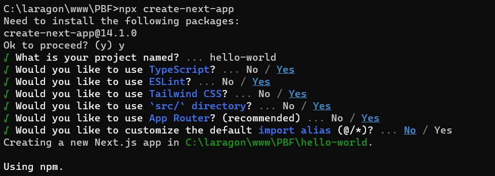
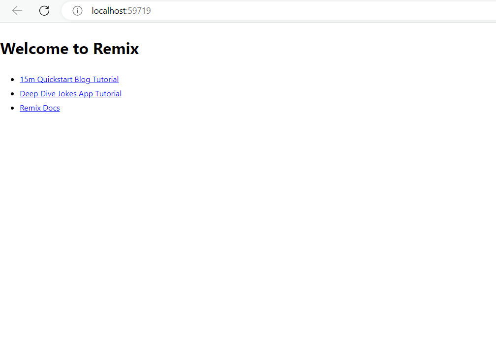
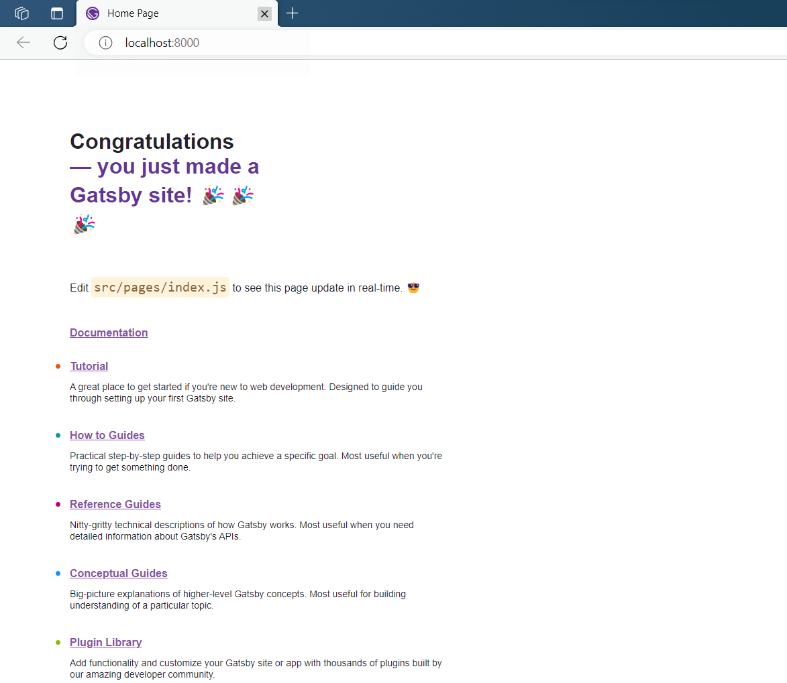
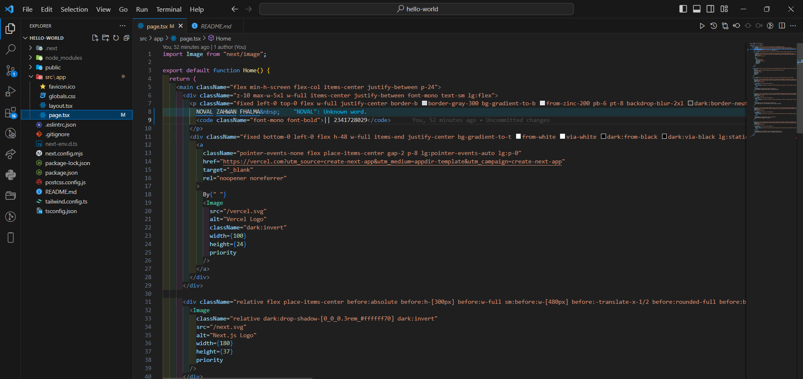
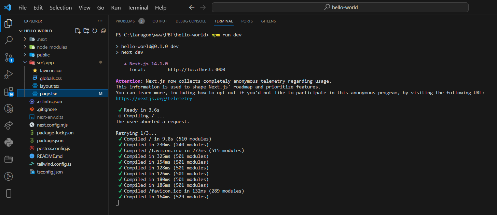
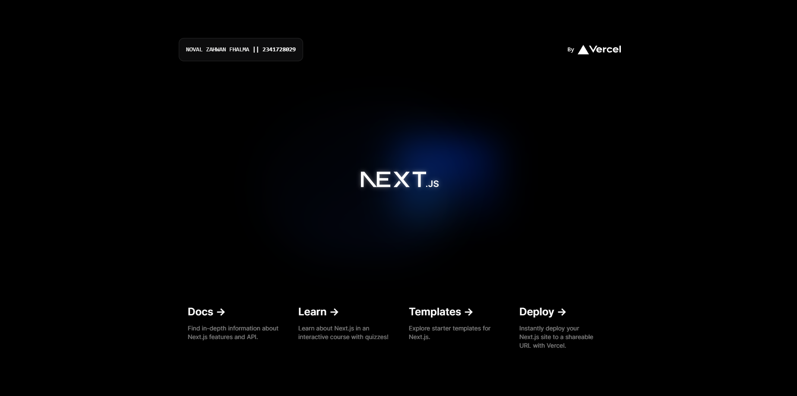

Langkah 1 : Buat folder baru

langkah 2 : Buat project baru

Soal 1

Pada gambar tersebut, silakan Anda browsing apa yang dimaksud dengan:

TypeScript adalah suoersetnya dari javascript. dengan menggunakan typescript codingan akan lebih terstruktur dn aman lebih aman dari error. 

ESLint adalah sebuah tools yang biasa digunakan untuk melakukan static analyzes untuk menemukan masalah pada codingan atau potensi yang bisa menimbulkan bug dengan cepat.

Tailwind CSS adalah sebuah framework yang mirip dengan bootstarp. Tailwind memiliki kelebihan mudah di integrasikan dengan react/nextjs, dokumentasi lengkap, tidak perlu custom-custom css karena class-class nya sudah lengkap.

App Router adalah  mekanisme atau pustaka yang memungkinkan pengembang untuk menangani navigasi antara berbagai halaman atau komponen dalam aplikasi web atau aplikasi berbasis web. Ini biasanya terkait dengan kerangka kerja pengembangan web tertentu seperti React Router untuk aplikasi React, Vue Router untuk aplikasi Vue.js, atau Router Angular untuk aplikasi Angular.

Import alias adalah cara untuk memberi nama alias atau julukan untuk modul yang diimpor dalam JavaScript atau TypeScript.

remix :

gatsby :

Perbedaan :

Remix :

Remix  berfokus pada pada konsep "Universal React" yang berarti dapat menggunakan React untuk membuat aplikasi yang serupa. Remix juga menawarkan kemampuan mengelola state, navigasi, dan pembuatan aplikasi yang terintegrasi dengan baik.

Gatsby :

Gatsby menyediakan berbagai plugin dan dukungan yang luas untuk mengintegrasikan berbagai sumber data, seperti CMS (Content Management System), API, dan file Markdown, ke dalam situs web. Gatsby juga memungkinkan untuk membuat situs web statis yang dioptimalkan dengan baik, yang berarti kontennya di-generate pada saat build dan kemudian disajikan ke pengguna.

Next.js :

Next.js memiliki kemampuan server-side rendering (SSR) yang setiap permintaan halaman akan di proses oleh server dan kemudian dikirimkan ke klien dan static site generation (SSG) yang memungkinkan untuk menghasilkan situs web statis pada waktu build, sehingga meningkatkan kecepatan dan kinerja situs.

langkah 3 : Buka dengan vscode

Soal 2

Pada struktur project tersebut, jelaskan kegunaan folder dan file masing-masing tersebut!

.git:

Folder ini adalah tempat di mana Git menyimpan semua informasi terkait dengan versi kontrol, seperti riwayat perubahan, cabang (branches), dan konfigurasi.

node_modules:

Folder ini adalah tempat di mana semua dependensi proyek yang diinstal menggunakan npm atau Yarn disimpan. Folder ini tidak perlu disimpan di repositori Git karena biasanya berisi banyak file dan dapat dihasilkan kembali dari file package.json dengan menggunakan perintah npm install atau yarn install.

public:

Folder ini biasanya digunakan untuk menyimpan berkas statis seperti gambar, ikon, atau file CSS yang tidak perlu diproses oleh alat pengelolaan modul seperti Webpack. Isi folder ini dapat diakses secara langsung oleh klien.

src:

Folder ini berisi kode sumber utama dari aplikasi Anda. Ini adalah tempat di mana Anda akan menulis komponen, logika bisnis, atau kode JavaScript/TypeScript lainnya yang akan digunakan dalam aplikasi Anda.

.eslintrc.json:

Berkas ini adalah konfigurasi untuk ESLint, alat linting untuk JavaScript/TypeScript. Ini mengatur aturan linting yang akan diterapkan pada kode Anda.

.gitignore:

Berkas ini berisi daftar pola file dan folder yang harus diabaikan oleh Git, artinya file dan folder yang tidak akan ditambahkan ke dalam repositori Git.

next.config.mjs:

Berkas ini adalah konfigurasi khusus untuk aplikasi Next.js, kerangka kerja React. Ini memungkinkan pengguna untuk menyesuaikan pengaturan dan perilaku aplikasi Next.js mereka.

next-env.d.ts:

Berkas ini adalah file deklarasi TypeScript khusus untuk aplikasi Next.js. Ini mendefinisikan lingkungan TypeScript untuk proyek Next.js.

pancake.json:

Berkas ini mungkin adalah konfigurasi khusus atau file proyek yang digunakan oleh aplikasi. Namun, tanpa konteks lebih lanjut, sulit untuk memberikan penjelasan yang lebih spesifik.

pancake-lock.json:

Ini mungkin adalah file yang dibuat oleh alat manajemen paket atau proyek yang digunakan untuk mengunci versi dependensi atau konfigurasi proyek.

postcss.config.js:

Berkas ini adalah konfigurasi untuk PostCSS, alat pengolahan CSS yang dapat diintegrasikan dengan alat bundling seperti Webpack. Ini dapat digunakan untuk menulis CSS dengan sintaks modern dan mengotomatisasi beberapa tugas pengolahan.

README.md:

Berkas ini adalah berkas Markdown yang digunakan untuk memberikan dokumentasi, instruksi, atau informasi tentang proyek kepada pengguna atau kontributor proyek.

tailwind.config.ts:

Berkas ini adalah konfigurasi untuk Tailwind CSS, kerangka kerja CSS yang dapat disesuaikan. Ini memungkinkan pengguna untuk menyesuaikan tema, mengonfigurasi plugin, dan mengatur opsi lainnya.

tsconfig.json:

Berkas ini adalah konfigurasi TypeScript yang mengatur opsi dan perilaku kompilasi TypeScript. Ini dapat digunakan untuk menentukan aturan, opsi, dan pengaturan lain yang berkaitan dengan proyek TypeScript Anda.

langkah 4 : Run

