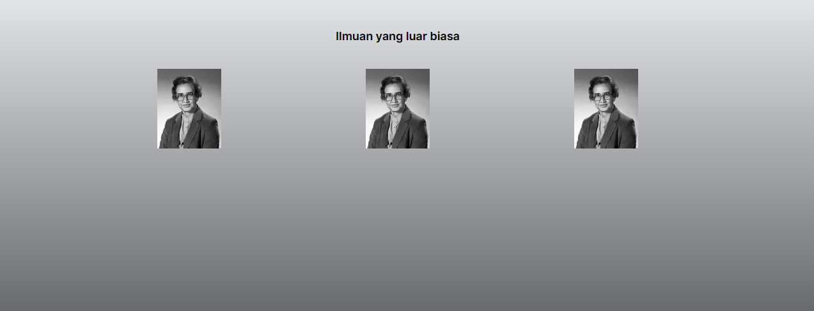

Langkah 1 : 

Yang bisa saya pelajari adalah jika ingin memanggi gambar dengan menggunkan domains maka domain tersebut harus di konfigurasi di next.config.mjs dan harus memanggil jujuga komponen yang telah di buat di halaman yg akan dituju dengan import Profile from "asal-components";. Terdapat beberapa error sebelum domains di konfigurasi di next.config.mjs dan di solve dengan menambahkan 

module.exports = {

images: {

      domains: ['i.imgur.com'],
    },
  };

  di next.config.mjs