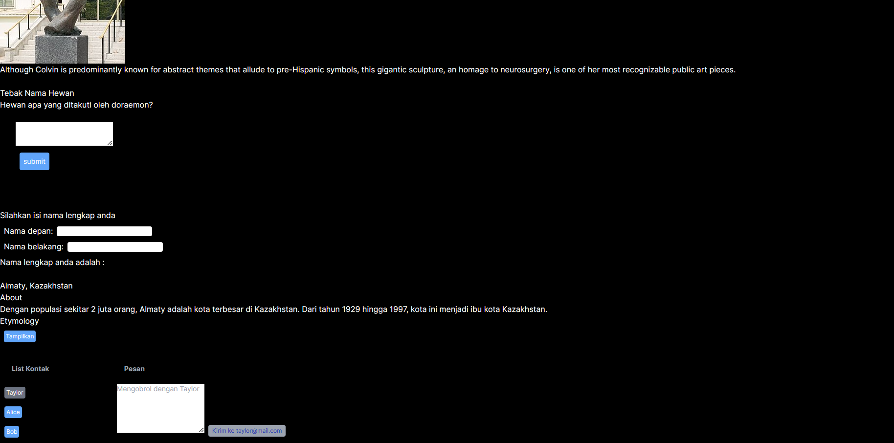

Pratikum 5

Yang terjadi pada tampilan browser terdapat tampilan pertanyaan "Hwan apa yanng ditakuti oleh doraemon?" serta di bawahnya terdapat kolom inputan jawaban dan tombol sumbit.

Ketika jawaban benar maka akan tampil "Yay... Jawaban benar" dan ketika jawaban salah makan akan tampil "Tebakan anda bagus tetapi salah, Silahkan coba lagi" 

Pratikum 5 - Soal 1

Di fungsi "Form_2" berisikan dua form inputan yaitu inputan nama depan dan inpunan nama belakang yang langsung di tampilkan di bawah dua form tersebut sedangkan "Form" berisikan form tebak tebakan yang jika salah akan menampilkan 'Tebakan bagus tapi jawaban salah, silahkan coba lagi' dan jika jawaban benar maka akan tampil 'Yey....jawaban benar'.

Pratikum 5 - Soal 2

Dikarenakan Fullname membuat redudan dan bisa membuat error.

Pratikum 6 - langkah 1

Terdapat dekripsi tentang Almaty, Kazakhstan dan jika di tekan "Tampilkan" maka akan tertanpil Etomology terkait Almaty, Kazakhstan.

Pratikum 6 - langkah 2

#Final

Pratikum 6 - Soal 1

to.email digunakan sebagai kunci karena diasumsikan bahwa setiap alamat email dalam kontak (contact) to adalah unik.

Pratikum 6 - Soal 2

Fungsi dari prop key adalah untuk memastikan identifikasi yang unik di antara elemen mana yang berubah.