Pratikum 1 : Membuat routing sederhana

Home
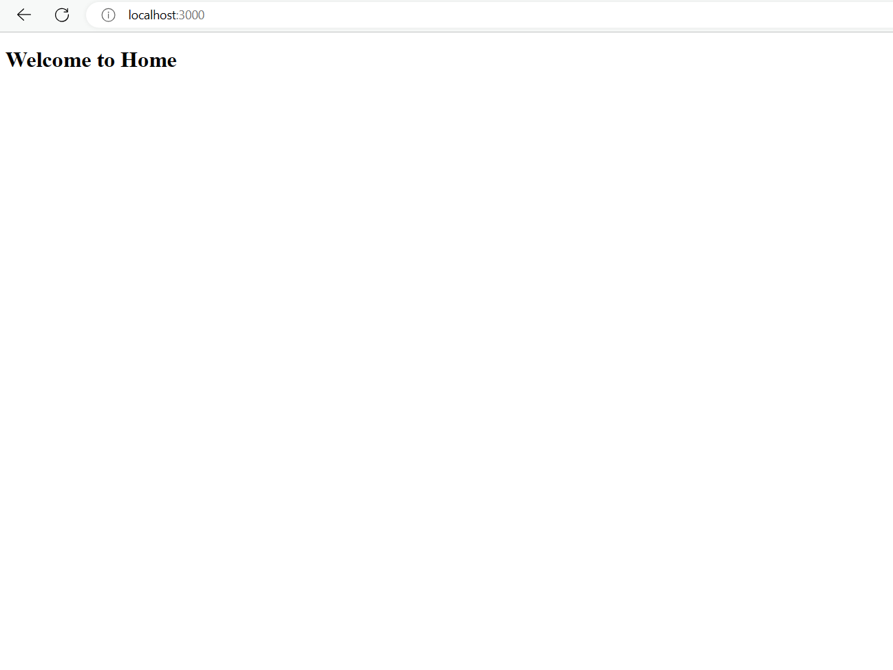

About
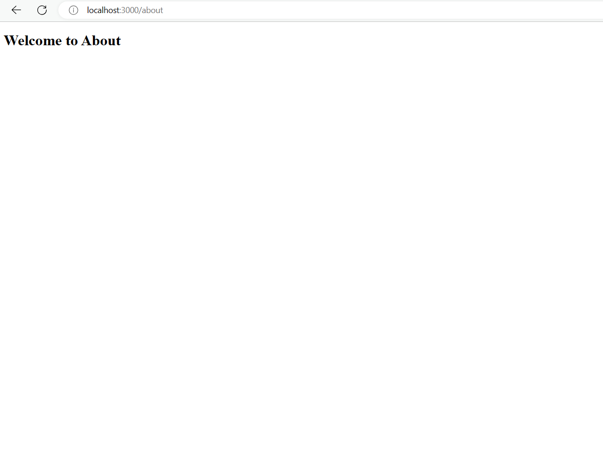

profile
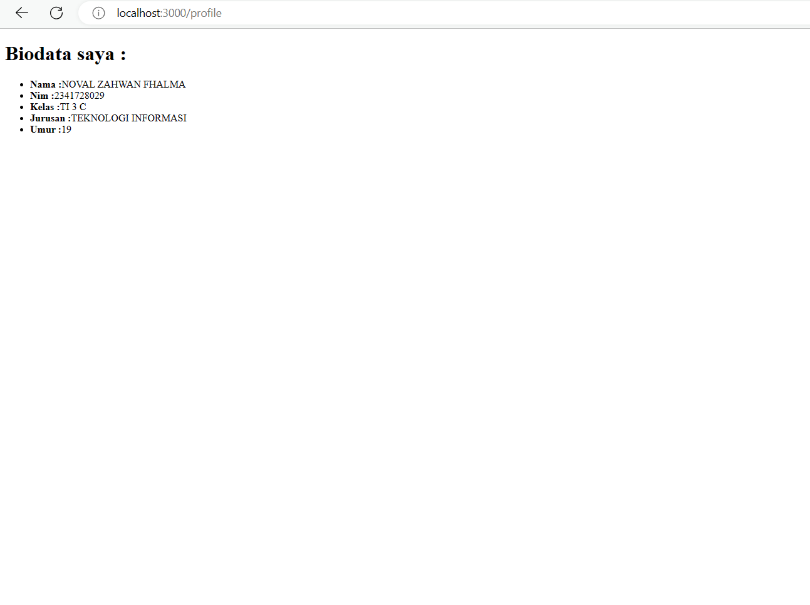

Pratikum 2 : Membuat routing bersarang (Nested routing)

Blogs
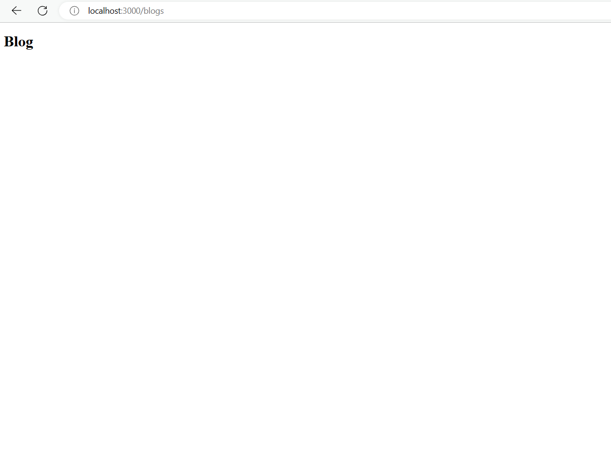

First Blogs
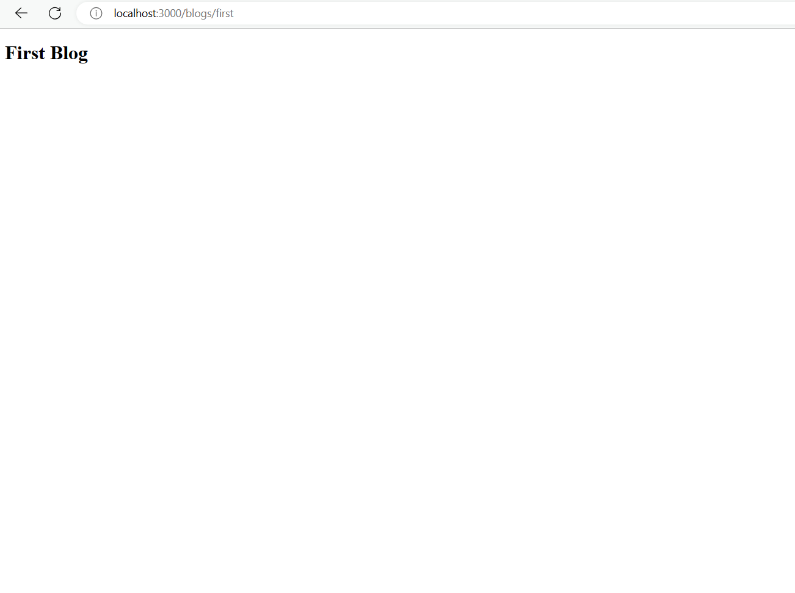

Second Blogs
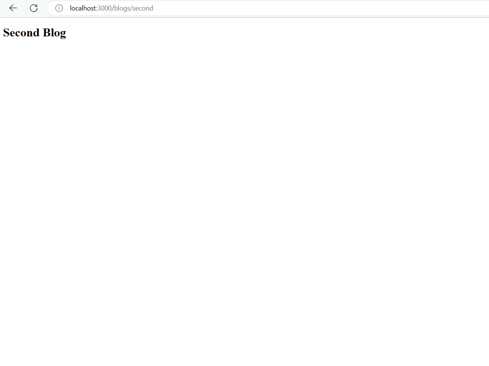

Pertanyaan: Apa kekurangan yang mungkin terjadi jika menggunakan pendekatan pada Praktikum 2 untuk menangani routing?

Jawaban: Kekurangan yang mungkin terjadi pada routing pada pratikum 2 adalah terlalu banyaknya tingkatan file sehingga bisa membuat kesulitan dalam pengembangann.

Pratikum 3 : Membuat routing dinamis (Dynamic routing)

langkah 1
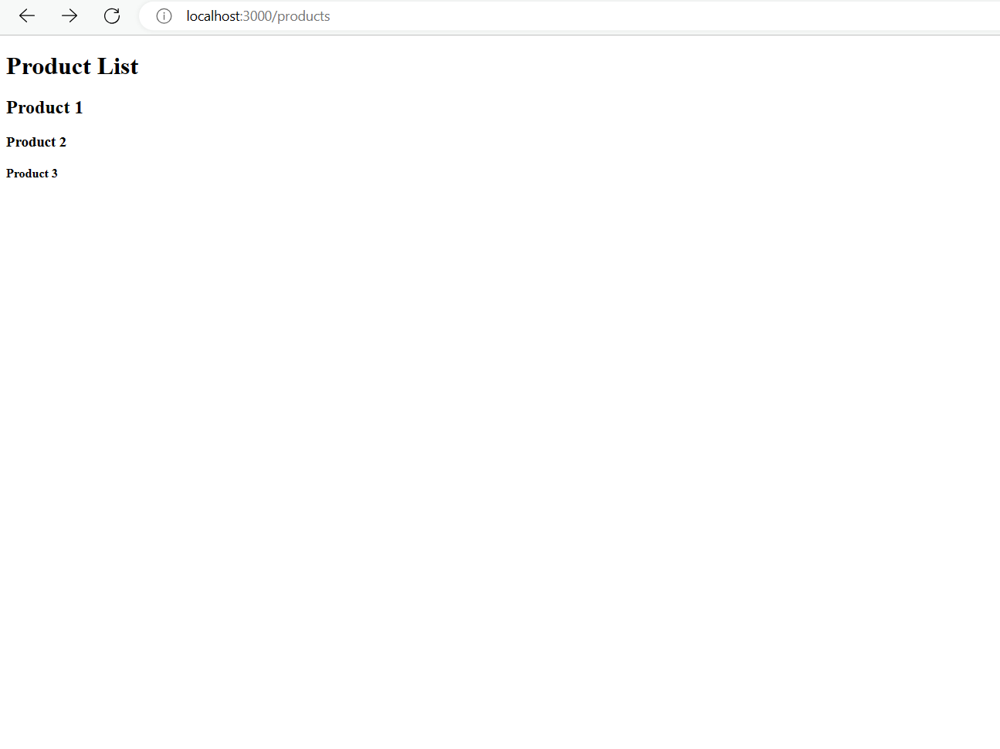

langkah 2
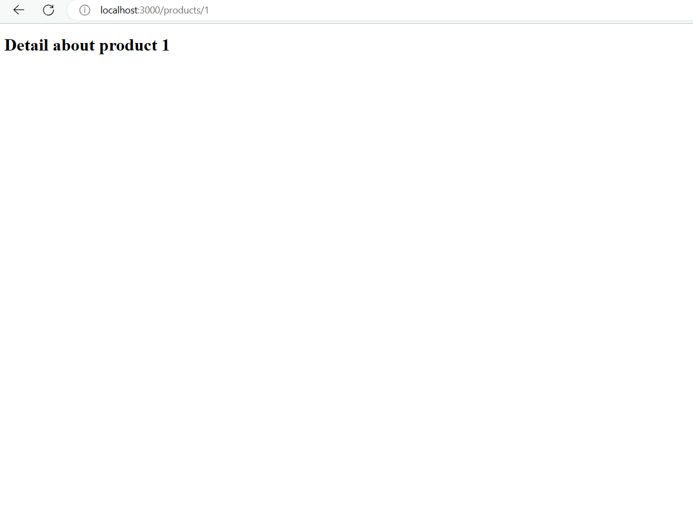

Todo 1: Perbaiki implementasi Praktikum 2 menggunakan Dynamic Routes
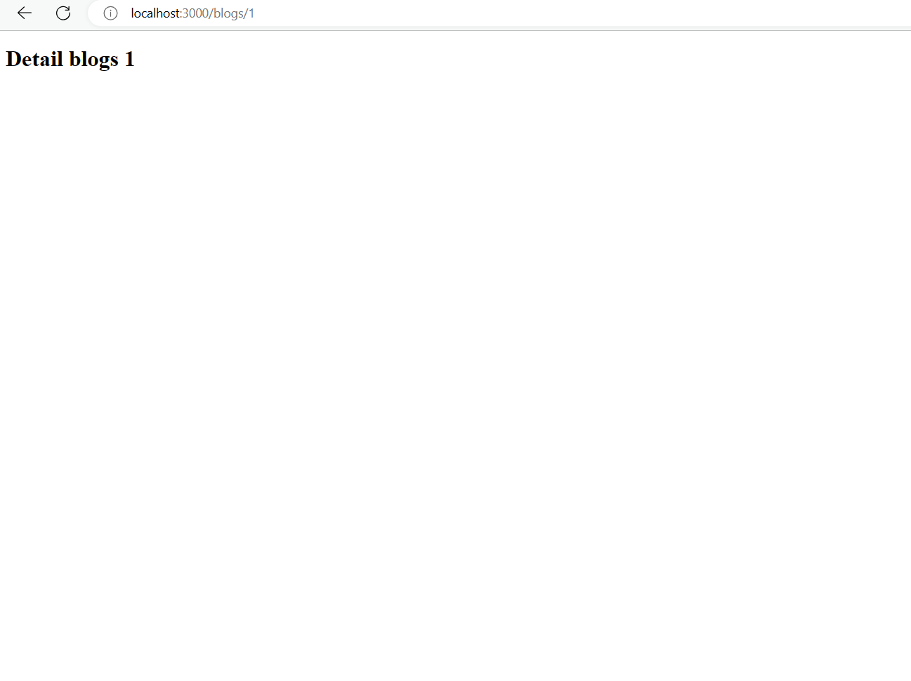

Todo 2: Dengan menggunakan konsep Nested Routes dan Dynamic Routes, buatlah halaman dengan routing /products/[productId]/reviews/[reviewId]
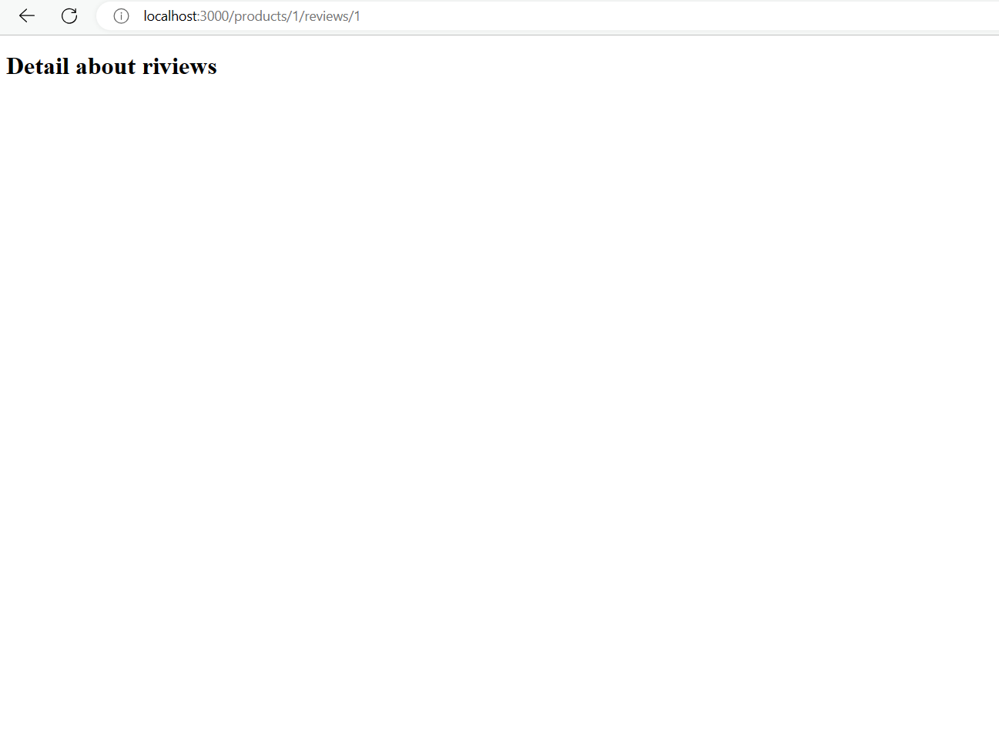

Pratikum 4 : Navigasi dengan link component

langkah 1
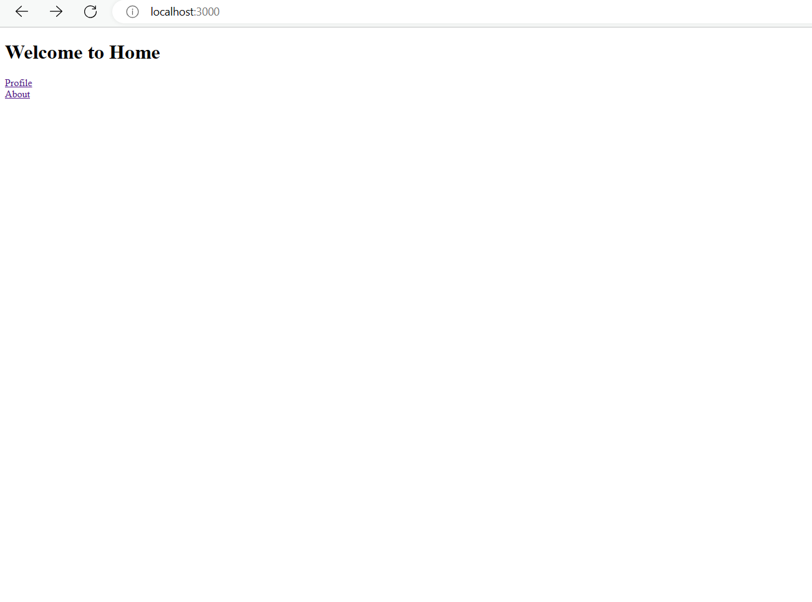

Todo : Tambahkan link yang sebelumnya anda telah kerjakan!
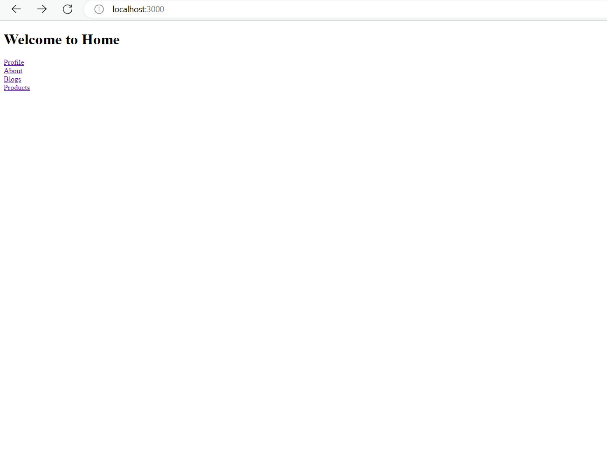