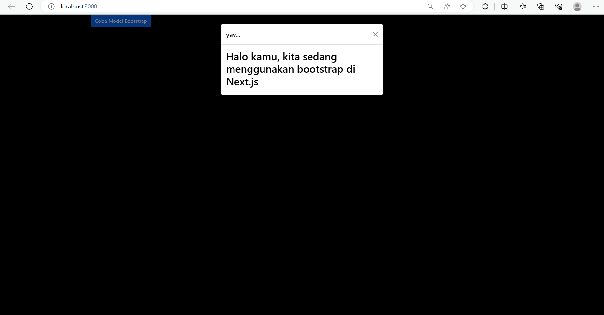
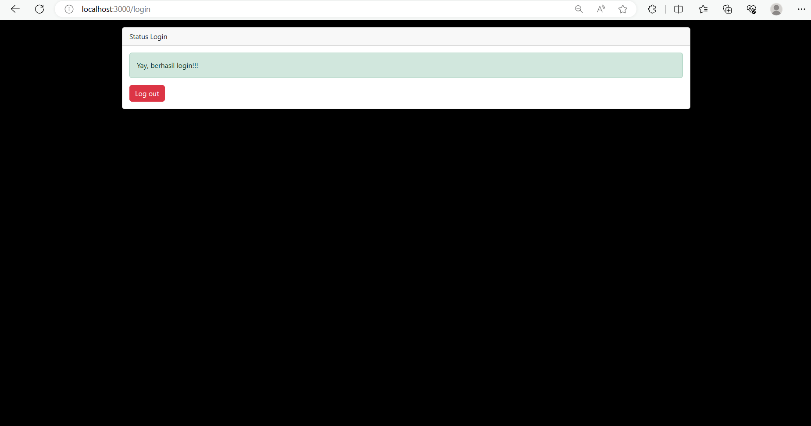
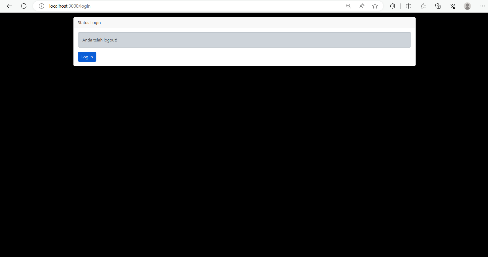
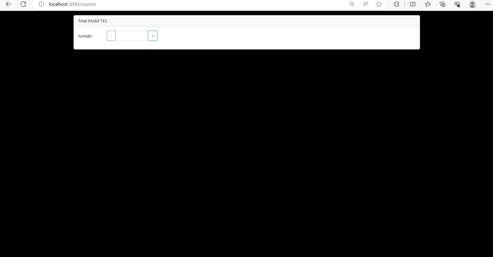

pratikum 1

pratikum 2

pratikum 3

TUGAS

1. Apa kegunaan dari kode ini import { useEffect } from "react"; Pada file pages/_app.tsx? jelaskan

Jawaban : Penggunaan useEffect dalam file pages/_app.tsx bertujuan untuk mengatur efek global yang berlaku di seluruh aplikasi React 

2. Jika pada file pages/_app.tsx kita tidak menggunakan useEffect (menghapus baris 3, dan baris 9-11, apa yang akan terjadi?

Jawaban : Setelah mengapus baris 3, dan baris 9-11 terdapat error "ReferenceError: MyApp is not defined" ketika kode dijalankan

3. Mengapa di react/nextjs penulisan tag html untuk class, harus diganti menjadi className ?

Jawaban : Dikarenakan class adalah kata kunci dalam JavaScript yang digunakan untuk mendefinisikan kelas. Karena JSX adalah ekstensi dari JavaScript, menggunakan class sebagai atribut akan menimbulkan konflik dengan penggunaan class sebagai kata kunci dalam JavaScript.

4. Apakah store pada nextjs bisa menyimpan banyak redux reducer?

Jawaban : Store Redux dalam aplikasi Next.js bisa menyimpan banyak reducer. Redux tidak membatasi jumlah reducer yang dapat Anda gunakan dalam satu store.

5. Jelaskan kegunaan dari file store.js!

Jawaban : File store.js dalam konteks aplikasi Redux digunakan untuk membuat store Redux. Store adalah pusat dari state aplikasi dalam arsitektur Redux. Ini menyimpan seluruh state aplikasi dalam satu objek tree tunggal.

6. Pada file pages/login.tsx, apa maksud dari kode ini ?
const { isLogin } = useSelector((state) => state.auth);

Jawaban : 
- useSelector: Ini disediakan oleh React Redux untuk memilih bagian tertentu dari state global Redux ke dalam komponen React. 
- (state) => state.auth: Ini adalah fungsi selektor yang digunakan untuk memilih bagian tertentu dari state Redux. Dalam hal ini, state adalah seluruh state Redux, dan state.auth mengacu pada bagian state yang berkaitan dengan autentikasi (atau "auth"). 
- { isLogin }: Ini adalah objek destructuring di JavaScript yang mengambil properti isLogin dari hasil fungsi selektor. 

7. Pada file pages/counter.tsx, apa maksud dari kode ini?
const {totalCounter} = useSelector((state) => state.counter);

Jawaban : Baris kode tersebut menggunakan useSelector dari React Redux untuk memilih nilai totalCounter dari bagian state Redux yang berkaitan dengan counter, kemudian menyimpannya dalam variabel totalCounter. Ini memungkinkan komponen counter.tsx untuk mengakses dan menggunakan nilai total counter yang disimpan dalam state Redux untuk keperluan tampilan atau logika di dalam komponen tersebut.